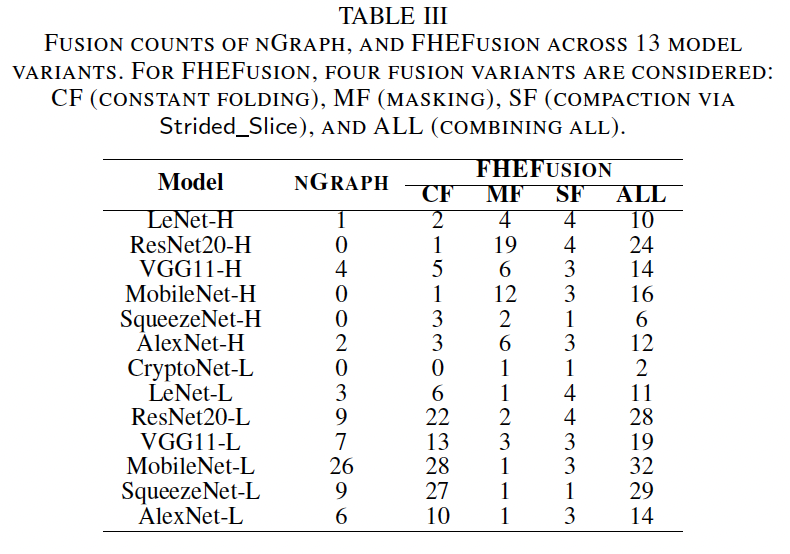
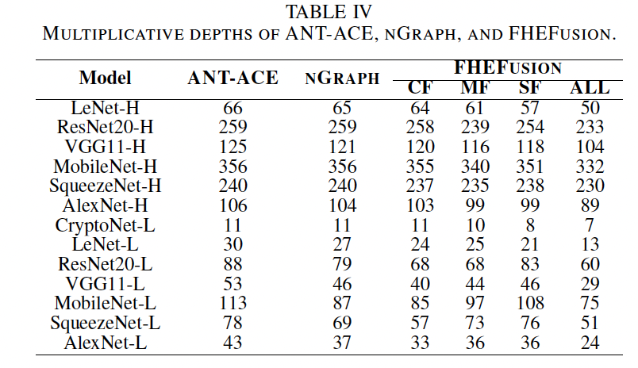
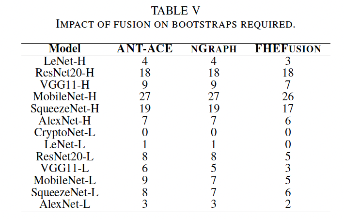
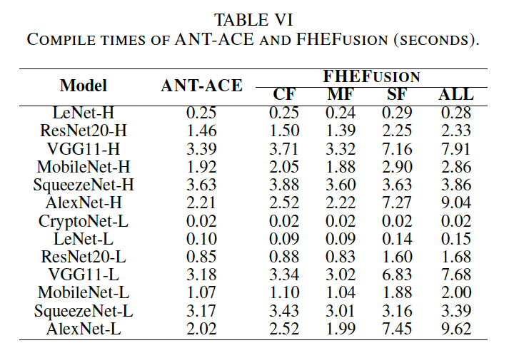
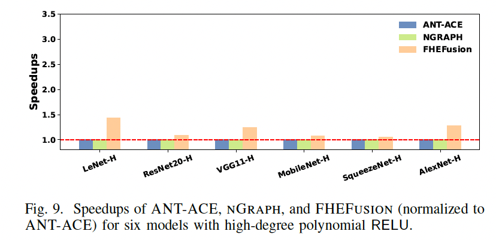
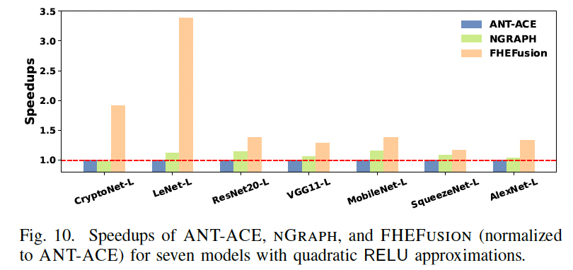
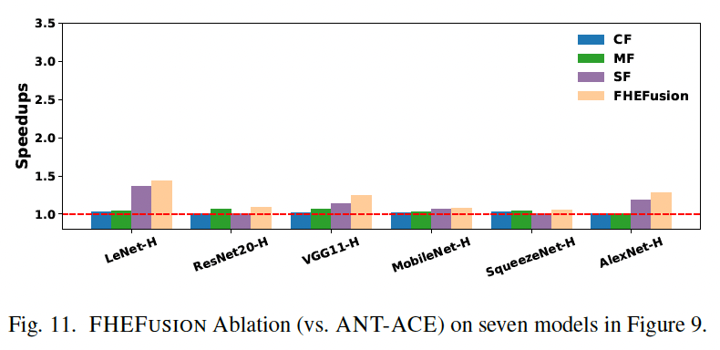
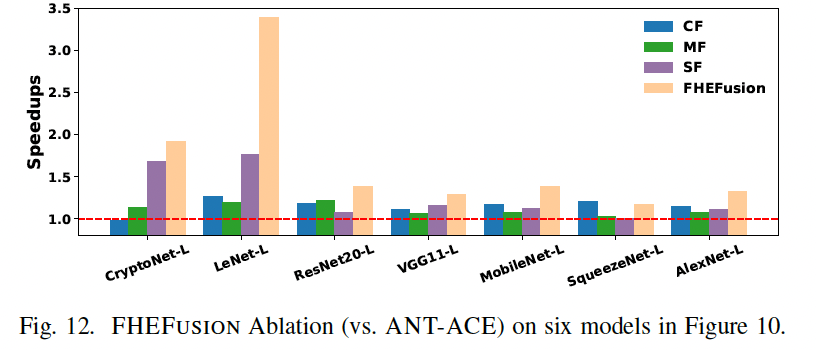

README
================

We provide instructions to enable the evaluation of the artifact associated with our CGO'26 Paper, titled "FHEFusion: Enabling Operator Fusion in FHE Compilers for Depth-Efficient DNN Inference". This paper presents FHEFusion, a compiler framework for the CKKS scheme that enables fusion through a new IR(https://github.com/ant-research/ace-compiler/tree/fhefusion).

This new IR preserves high-level DNN semantics while introducing FHE-aware operators—masking and compaction (Strided Slice)—that are central to CKKS, thereby exposing broader fusion opportunities. Guided by algebraic rules and an FHE-aware cost model, FHEFusion reduces multiplicative depth and identifies profitable fusions. FHEFusion is implemented in the open-source ANT-ACE compiler [Li et al. CGO'25](https://dl.acm.org/doi/10.1145/3696443.3708924) with about 4000 lines of C++ code.

In our evaluation, we compared the FHEFusion with nGraph(https://dl.acm.org/doi/10.1145/3310273.3323047), the only prior work on graph-level fusion, which applies three constant-folding patterns—AvgPool, Activation, and BatchNorm Folding—to reduce multiplicative depth. Since nGraph lacks bootstrapping and supports only small models, we reimplemented these patterns in ANT-ACE; hereafter, nGraph refers to this implementation. We evaluate FHEFusion on seven DNN models widely used in FHE: CryptoNet/LeNet/ResNet20/VGG11/MobileNet/AlexNet/SqueezeNet. CryptoNet, with $x^2$ activation, is tested on MNIST; the others use RELU with CIFAR-10 and require bootstrapping. For RELU, we use two approximations multi-term polynomials(m-H) and a quadratic $ax^2 + bx + c$(m-L). CryptoNet is restricted to its native $x^2$ activation (denoted CryptoNet-L), so in total we evaluate 13 model variants.

The objective of this artifact evaluation is to reproduce our results, presented in Tables 3-6 and Figures 9-12:
- **Table 3**: FUSION COUNTS OF nGraph, AND FHEFusion ACROSS 13 MODEL VARIANTS. FOR FHEFusion, FOUR FUSION VARIANTS ARE CONSIDERED: CF (CONSTANT FOLDING), MF (MASKING), SF(COMPACTION VIA Strided_Slice), AND ALL (COMBINING ALL).
- **Table 4**: MULTIPLICATIVE DEPTHS OF ANT-ACE, nGraph, AND FHEFusion.
- **Table 5**: IMPACT OF FUSION ON BOOTSTRAPS REQUIRED.
- **Table 6**: COMPILE TIMES OF ANT-ACE AND FHEFusion (SECONDS).
- **Figure 9**: Speedups of ANT-ACE, nGraph, and FHEFusion (normalized to ANT-ACE) for six models with high-degree polynomial RELU.
- **Figure 10**: Speedups of ANT-ACE, nGraph, and FHEFusion (normalized to ANT-ACE) for seven models with quadratic RELU approximations.
- **Figure 11**: FHEFusion Ablation (vs. ANT-ACE) on seven models in Figure 9
- **Figure 12**: FHEFusion Ablation (vs. ANT-ACE) on six models in Figure 10.

*Let us begin by noting that performing artifact evaluation for FHE compilation, especially for encrypted inference, is challenging due to the substantial computing resources and significant running times required.*

It is important to highlight that FHE remains significantly slower—by up to **10,000×**—compared to unencrypted computation, even for relatively small machine learning models. Generating the results shown in **Tables 3–6** and **Figures 9–12** takes approximately **50 hours**.

To support artifact evaluation, we provide detailed instructions, including environment setup and execution guidelines, to ensure that our research findings can be independently verified.

**Hardware Setup:**  
- Intel Xeon Platinum 8369B CPU @ 2.70 GHz  
- 512 GB memory
- 50 GB free disk space

**Software Requirements:**  
- x86_64 Linux (64-bit) with Docker enabled
- Detailed in the [*Dockerfile*](https://github.com/ant-research/ace-compiler/blob/fhefusion/Dockerfile) for Docker container version 25.0.1
- Docker image based on Ubuntu 24.04

Encrypted inference is both compute-intensive and memory-intensive. A computer with at least **500GB** of memory is required to perform artifact evaluation for our work.

## Repository Overview
- **air-infra:** Contains the base components of the ACE compiler with FHEFusion support.
- **fhe-cmplr:** Houses FHE-related components of the ACE compiler with FHEFusion support.
- **nn-addon:** Includes ONNX-related components for the ACE compiler with FHEFusion support.
- **model:** Stores ONNX models.
- **scripts:** Scripts for building and running FHEFusion and tests.
- **test:** Test related.
- **README.md:** This [*README*](https://github.com/ant-research/ace-compiler/blob/fhefusion/README.md) file.
- **Dockerfile:** Used to build the Docker image for running all tests
- **requirements.txt:** Specifies Python package requirements.

### 1. Preparing a DOCKER environment to Build and Test the FHEFusion

It is recommended to pull the pre-built docker image (opencc/ace:fusion) from Docker Hub:
```
cd [YOUR_DIR_TO_DO_AE]
mkdir -p ae_result
docker pull opencc/ace:fusion
docker run -it --name fusion -v "$(pwd)"/ae_result:/app/ae_result --privileged opencc/ace:fusion bash
```
A local directory `ae_result` is created and mounted in the docker container to collect the generated figures and tables. The container will launch and automatically enters the `/app` directory:
```
root@xxxxxx:/app#
```

*Note: The compressed Docker image is approximately 2 GB and may take **several minutes to over an hour** to download, depending on your network speed.*

### 2. Running All Tests

In the `/app` directory of the container, run:
```
/app/scripts/run_full.sh
```

This command will perform the following actions:
  - Build ACE compiler with FHEFusion
  - Compile and run all cases
  - Generate all figures and tables in /app/ae_result inside docker or [YOUR_DIR_TO_DO_AE]/ae_result on host

Upon successful completion, you will see:
```
......
Chart saved to /app/ae_result/Figure12.pdf
All figures and tables have been generated successfully.
All steps completed successfully
```

*Note 1: For the hardware environment outlined above, it will take **approximately 50 hours** to complete all the FHEFusion tests using a single thread.*

The script will generate results corresponding to the figures and tables presented in the evaluation section of our paper. The output files include: `Table3.pdf`, `Table4.pdf`, `Table5.pdf`, `Table6.pdf`, `Figure9.pdf`, `Figure10.pdf`, `Figure11.pdf`, and `Table12.pdf`. For raw data, please refer to the corresponding `.log` and `.t` files.

Here is what you can expect from each file:

- **Table3.pdf**:
  
- **Table4.pdf**:
  
- **Table5.pdf**:
  
- **Table6.pdf**:
  
- **Figure9.pdf**:
  
- **Figure10.pdf**:
  
- **Figure11.pdf**:
  
- **Figure12.pdf**:
  

*Note: The appearance of the generated PDF files may vary slightly depending on the hardware environment used.*
