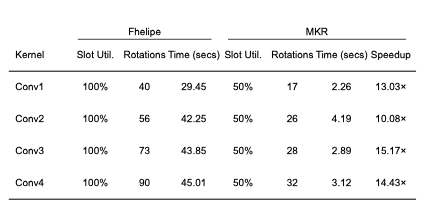
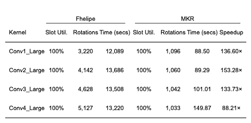
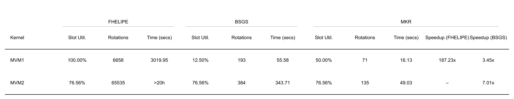
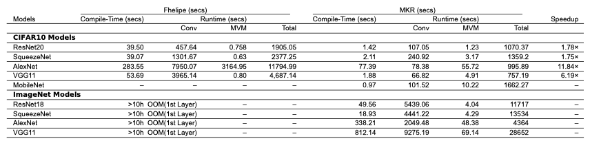
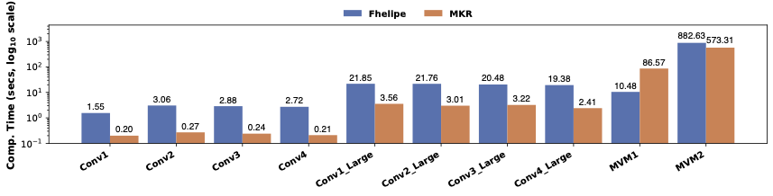
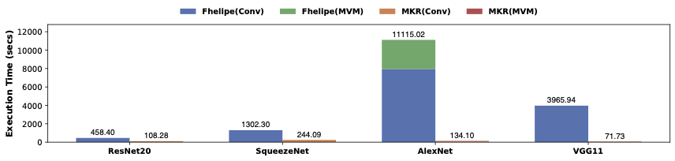
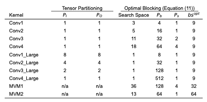

README
================

We provide instructions to enable the evaluation of the artifact associated with our OOPSLA'25 paper, titled "MetaKernel: Enabling Efficient Encrypted Neural Network Inference Through Unified MVM and Convolution". This paper presents MetaKernel(MKR), a novel composition-based compiler approach that optimizes MVM and Conv kernel
operations for DNN models under CKKS within a unified framework.

MKR decomposes each kernel into composable units to enhance SIMD parallelism within ciphertexts (via horizontal batching) and computational parallelism across them (via vertical batching). Our approach addresses previously unaddressed challenges, such as reducing rotation overhead with a rotation-aware cost model for data packing, while ensuring high slot utilization, handling inputs of arbitrary sizes, and maintaining output tensor layout compatibility. MKR is implemented in the open-source ANT-ACE compiler [Li et al. CGO'25] with about 3500 lines of C++ code.

In our evaluation, we compared the MKR with FHELIPE [Krastev et al. PLDI'24], a state-of-the-art FHE compiler using 10 micro MVM and Conv kernels from real-world DNN models and 5 DNN models: ResNet-20/SqueezeNet/AlexNet/VGG11/MobileNet on both CIFAR-10 and ImageNet. The objective of this artifact evaluation is to reproduce our results, presented in Figures 7-8 and Tables 4-8:
- **Table 4**: Comparison of MKR and FHELIPE for small Conv Kernels
- **Table 5**: Comparison of MKR and FHELIPE for large Conv kernels
- **Table 6**: Comparison of MKR and FHELIPE for MVM kernels
- **Table 7**: Comparison of compile and inference times for DNN models generated by MKR and FHELIPE
- **Figure 7**: Comparison of MKR and FHELIPE in compile time for MVM and Conv Kernels
- **Figure 8**: Comparison of MKR and FHELIPE for Conv and MVM contributions to inference time across models
- **Table 8**: MKR's tensor partitioning and optimal IMRA blocking results for MVM and Conv kernels

*Let us begin by noting that performing artifact evaluation for FHE compilation, especially for encrypted inference, is challenging due to the substantial computing resources and significant running times required.*

It is essential to emphasize that FHE remains up to 10,000 times slower than unencrypted computation, even for small machine learning models. To generate Figures 7-8 and Tables 4-6, the process will take **approximately 48 hours**.

To facilitate artifact evaluation, we provide detailed steps, environment setup, and execution guidelines to ensure that the findings of our research can be independently verified.


**Hardware Setup:**  
- Intel Xeon Platinum 8369B CPU @ 2.70 GHz  
- 512 GB memory

**Software Requirements:**  
- Detailed in the [*Dockerfile*]__(https://anonymous.4open.science/r/mkr_artifact/Dockerfile)__ for Docker container version __25.0.1__
- Docker image based on Ubuntu __20.04__

Encrypted inference is both compute-intensive and memory-intensive. A computer with at least **400GB** of memory is required to perform artifact evaluation for our work.


## Repository Overview
- **FHELIPE:** Directory for FHELIPE source code, patches and test cases and scripts.
- **model:** Contains pre-trained ONNX models for MKR evaluation.
- **raw_data:** Raw testing logs for reference.
- **source:** Contains the source code for MKR.
- **scripts:** Scripts for building and running MKR and FHELIPE tests.
- **Dockerfile:** File to create Docker image to perform all tests.
- **README.md:** This README file.

### 1. Preparing a DOCKER environment to Build and Test the MetaKernel

It is recommended to pull the pre-built docker image __(opencc/mkr:latest)__ from Docker Hub:
```
cd [YOUR_DIR_TO_DO_AE]
mkdir -p mkr_ae_result
docker pull opencc/mkr:latest
docker run -it --name mkr -v "$(pwd)"/mkr_ae_result:/app/mkr_ae_result --privileged opencc/mkr:latest bash
```
A local directory `mkr_ae_result` is created and mounted in the docker container to collect the generated figures and tables. The container will launch and automatically enters the `/app` directory:
```
root@xxxxxx:/app#
```

### 2. Building the MKR Compiler

To build the MKR compiler, navigate to the `/app` directory within the container and run:
```
/app/scripts/build_cmplr.sh Release
```
Upon successful completion, you will see:
```
Info: build project succeeded. MKR compiler executable can be found in /app/mkr_cmplr/bin/fhe_cmplr
root@xxxxxx:/app#
```
The MKR compiler will be built under `/app/release` and installed in the `/app/mkr_cmplr` directory.


### 3. Running All MKR Tests

In the `/app` directory of the container, run:
```
python3 /app/scripts/mkr.py
```

This command will perform the following actions:
  - Compile and run all MVM and Conv kernels listed in Table 3
  - Compile and run all DNN models listed in Table 7

All pre-trained ONNX models utilized by the MKR compiler are located in the [*model*] directory.

Upon successful completion, you will see:
```
BLAHBLAH BLAH BLAH
root@xxxxxx:/app#
```

*Note: For the hardware environment outlined above, it will take **approximately 24 hours** to complete all the MKR tests using a single thread.*

### 4. Running all FHELIPE Tests

In the `/app` directory of the container, run:
```
python3 /app/FHELIPE/fhelipe.py
```

This command will perform the following actions:
  - Pull original FHELIPE code from github
  - Apply patches for timing and new models for performance comparison
  - Build fhelipe compiler
  - Compile and run all MVM and Conv kernels listed in Table 3
  - Compile and run all DNN models listed in Table 7

All FHELIPE tests are implemented in /app/FHELIPE/source/frontend/fheapps in the [*FHELIPE*] directory.

Upon successful completion, you will see:
```
BLAHBLAH BLAH BLAH
root@xxxxxx:/app#
```

*Note: For the hardware environment outlined above, it will take **approximately 24 hours** to complete all the MKR tests using a single thread. The cases which runs exceeds 20 hours are ignored in the test include MVM with shape [4096, 25088] and all DNN models on ImageNet. *


### 5. Generate all figures and tables
Once command 2, 3 and 4 completed successfully, in the `/app` directory of the container, run:
```
python3 /app/scripts/generate_figures.py
```
The script will generate the results as depicted in the figures and tables of our paper. The outputs are named 'Table4.pdf', 'Table5.pdf', 'Table6.pdf', 'Table7.pdf', 'Figure7.pdf', 'Figure8.pdf' and 'Table8.pdf'. For the raw data, please refer to the corresponding *.log files.

Here is what you can expect from each file:

- **Table4.pdf**:
  
- **Table5.pdf**:
  
- **Table6.pdf**:
  
- **Table7.pdf**:
  
- **Figure7.pdf**:
  
- **Figure8.pdf**:
  
- **Table8.pdf**:
  

*Note: The appearance of the generated PDF files might vary slightly due to differences in the hardware environments used.*