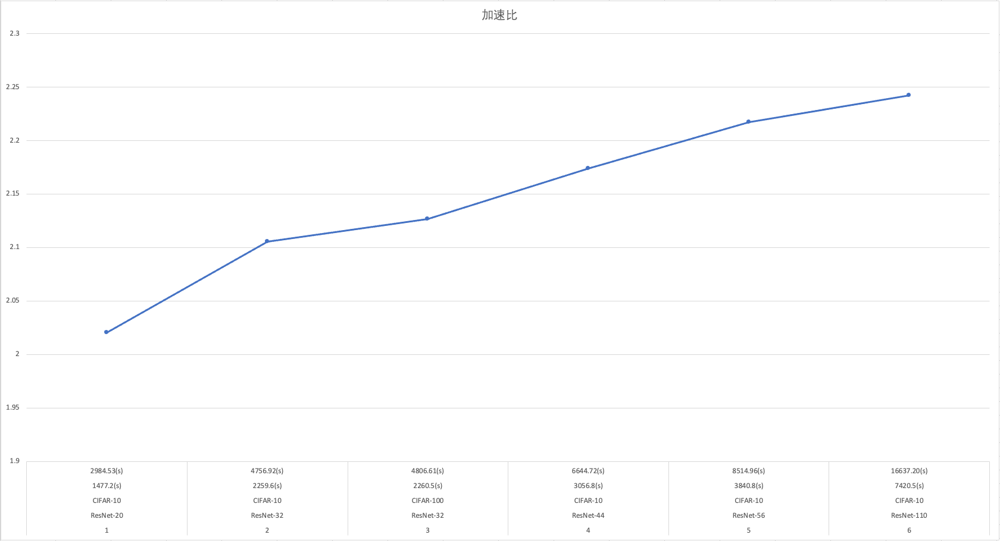
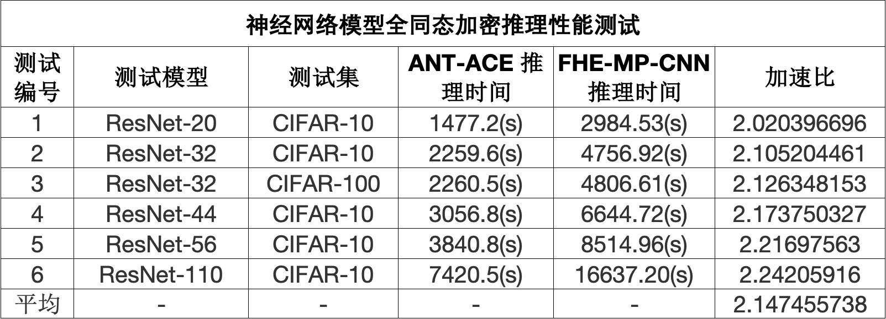
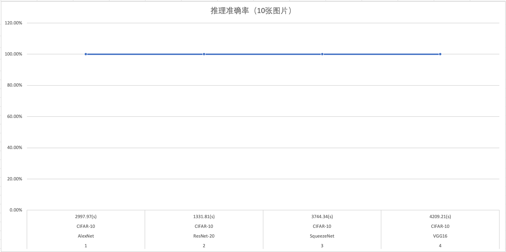
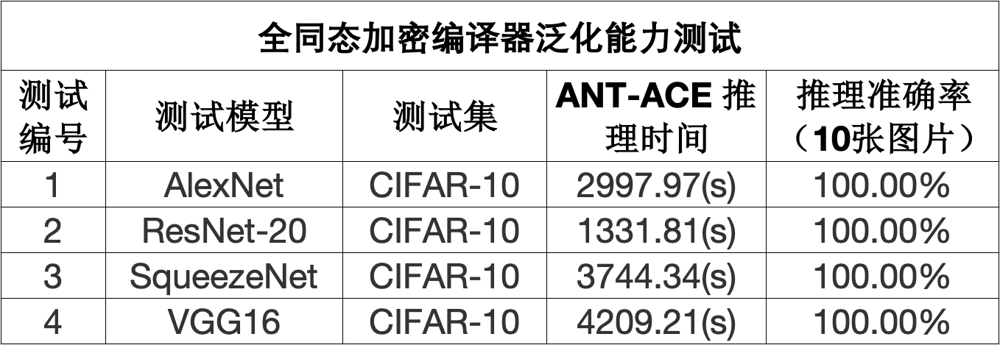
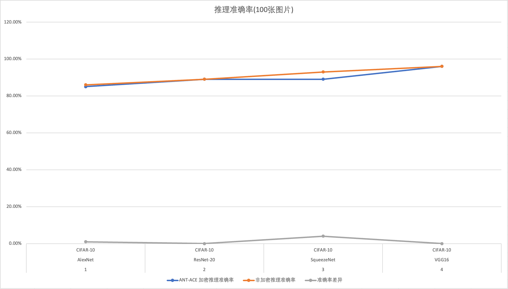
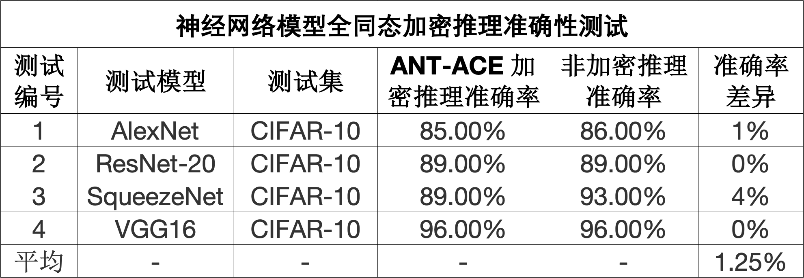
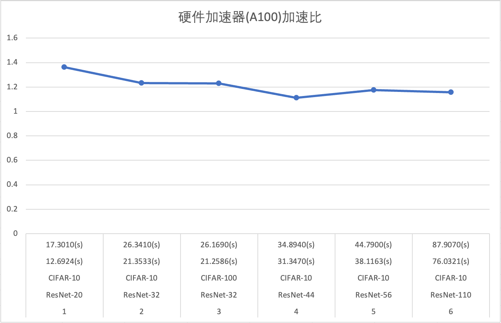
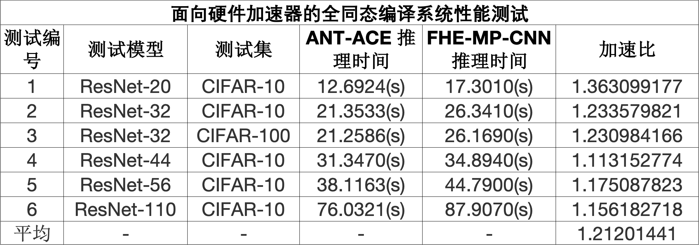

# Testing Report

## 7.1 Testing the Inference Performance of Neural Networks for Fully Homomorphic Encryption

| 测试编号 |   测试模型   |   测试集   | ANT-ACE 推理时间 | FHE-MP-CNN 推理时间 |     加速比   |
|---------|------------|-----------|-----------------|--------------------|-------------|
|    1    | ResNet-20  | CIFAR-10  |    1477.2(s)    |     2984.53(s)     | 2.020396696 |
|    2    | ResNet-32  | CIFAR-10  |    2259.6(s)    |     4756.92(s)     | 2.105204461 |
|    3    | ResNet-32  | CIFAR-100 |    2260.5(s)    |     4806.61(s)     | 2.126348153 |
|    4    | ResNet-44  | CIFAR-10  |    3056.8(s)    |     6644.72(s)     | 2.173750327 |
|    5    | ResNet-56  | CIFAR-10  |    3840.8(s)    |     8514.96(s)     | 2.21697563  |
|    6    | ResNet-110 | CIFAR-10  |    7420.5(s)    |     16637.20(s)    | 2.24205916  |
|   平均   |     -      |     -     |       -         |          -         | 2.147455738 |

## 7.2 Generalization Ability Test of Fully Homomorphic Encryption Compiler

| 测试编号 |   测试模型   |   测试集  | ANT-ACE 推理时间 | 推理准确率（10张图片）|
|---------|------------|----------|-----------------|--------------------|
|    1    |  AlexNet   | CIFAR-10 |    2997.97(s)   |      100.0%        |
|    2    | ResNet-20  | CIFAR-10 |    1331.81(s)   |      100.0%        |
|    3    | SqueezeNet | CIFAR-10 |    3744.34(s)   |      100.0%        |
|    4    |    VGG16   | CIFAR-10 |    4209.21(s)   |      100.0%        |

## 7.3 Testing the Inference Accuracy of Neural Network Models for Fully homomorphic Encryption

| 测试编号 |   测试模型   |   测试集  | ANT-ACE 加密推理准确率 | 非加密推理准确率 | 准确率差异 |
|---------|------------|----------|----------------------|---------------|----------|
|    1    |   AlexNet  | CIFAR-10 |        85.0%         |     86.0%     |    1%    |
|    2    |  ResNet-20 | CIFAR-10 |        89.0%         |     89.0%     |    0%    |
|    3    | SqueezeNet | CIFAR-10 |        89.0%         |     93.0%     |    4%    |
|    4    |    VGG16   | CIFAR-10 |        96.0%         |     96.0%     |    0%    |
|   平均   |     -      |     -    |         -            |      -        |  1.25%  |

## 7.4 Performance Testing of Fully homomorphic Compilation Systems for Hardware Accelerators

NVIDIA A100

| 测试编号 |    测试模型  |   测试集   | ANT-ACE 推理时间 | FHE-MP-CNN 推理时间 |    加速比    |
|---------|------------|-----------|-----------------|--------------------|-------------|
|    1    | ResNet-20  | CIFAR-10  |    12.6924(s)   |     17.3010(s)     | 1.363099177 |
|    2    | ResNet-32  | CIFAR-10  |    21.3533(s)   |     26.3410(s)     | 1.233579821 |
|    3    | ResNet-32  | CIFAR-100 |    21.2586(s)   |     26.1690(s)     | 1.230984166 |
|    4    | ResNet-44  | CIFAR-10  |    31.3470(s)   |     34.8940(s)     | 1.113152774 |
|    5    | ResNet-56  | CIFAR-10  |    38.1163(s)   |     44.7900(s)     | 1.175087823 |
|    6    | ResNet-110 | CIFAR-10  |    76.0321(s)   |     87.9070(s)     | 1.156182718 |
|   平均   |      -     |      -    |        -       |          -          | 1.21201441  |

## 7.5 补充配套运行时系统测试项

| 测试编号 |    测试项   |               测试子项             |          测试用例         | 测试结果 |
|---------|------------|----------------------------------|--------------------------|---------|
|    1    |  多项式计算  | 多项式加法计算（多项式+多项式 ）      |   eg_fhertlib_add        |  PASS   |
|    2    |  多项式计算  | 多项式加法计算（多项式+常量）         |   eg_fhertlib_add_const  |  PASS   |
|    3    |  多项式计算  | 多项式乘法计算（多项式*多项式）       |   eg_fhertlib_gemm       |  PASS   |
|    4    |  多项式计算  | 多项式乘法计算（多项式*常量）         |   eg_fhertlib_mul_const  |  PASS   |
|    5    |  多项式计算  | 多项式自举计算                     |   eg_fhertlib_bootstrap  |  PASS   |
|    6    |  多项式计算  | 多项式二维卷积计算（多项式+常量）     |   eg_fhertlib_conv2d     |  PASS   |
|    7    |  多项式计算  | 多项式重线性化计算                  |   eg_fhertlib_relin      |  PASS   |
|    8    |   模型计算   | alexnet模型计算                   |   alexnet_cifar10        |  PASS   |
|    9    |   模型计算   | resnet模型计算（resnet20_cifar10） |   resnet20_cifar10       |  PASS   |
|   10    |   模型计算   | resnet模型计算（resnet32_cifar10） |   resnet32_cifar10       |  PASS   |
|   11    |   模型计算   | resnet模型计算（resnet44_cifar10））|   resnet44_cifar10       |  PASS   |
|   12    |   模型计算   | resnet模型计算（resnet56_cifar10） |   resnet56_cifar10       |  PASS   |
|   13    |   模型计算   | squeezenet模型计算                 |  squeezenet_cifar10     |   PASS  |
|   14    |   模型计算   | vgg16模型计算（多项式+常量）         |  vgg16_cifar10           |  PASS  |
